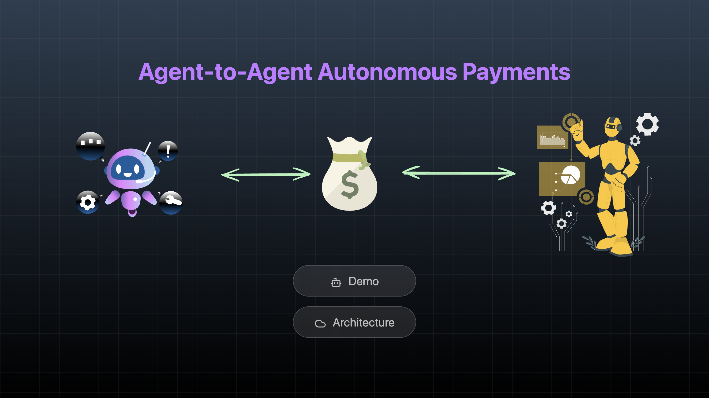
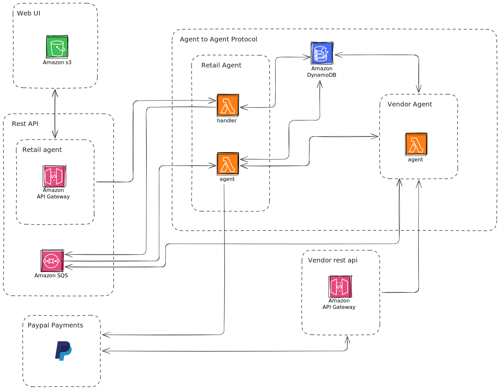
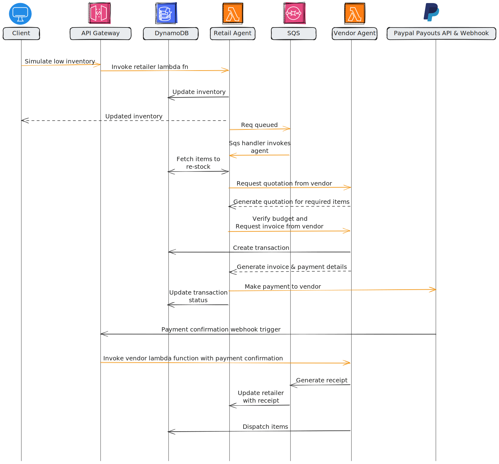

# 💸 Agent-to-Agent Autonomous Payment

This demo showcases **Agent-to-Agent autonomous payments** between two simulated business entities:

- **☘️ Clover Pharmacy** – a retail agent responsible for managing inventory and initiating payments.
- **💊 Pfifier Meds Manufacturing Ltd.** – a vendor agent that issues invoices and supplies goods.

### **<u>How It Works</u>**
- The **retail agent**, within a pre-set **budget**, evaluates inventory and places orders to re-stock low inventory items.
- The **vendor agent** generates quotations and invoices for the goods requested by the retail agent.
- The **retail agent**, parses the invoice and initiates a **PayPal Payment** to the vendor.
- The **vendor agent** on payment confirmation generates a receipt and dispatches the goods.
- Payments are made **autonomously**, simulating real-world A2A interactions without human intervention.

## Watch Demo

[](https://www.youtube.com/watch?v=9vdFTzNN3Rk)

## Try it Yourself

https://a2a.tryamnesia.com/

## 🚀 System Overview

| Component        | Description                                                  |
| ---------------- | ------------------------------------------------------------ |
| **Retail Agent** | AWS Lambda that detects low inventory and initiates purchase |
| **Vendor Agent** | AWS Lambda that prepares quotation, invoice and ships items  |
| **SQS**          | Connects Retail and Vendor agents asynchronously             |
| **PayPal**       | Sends payout to vendor using PayPal Payouts API              |
| **Webhook**      | Listens for payment status and updates inventory             |
| **DynamoDB**     | Stores inventory and transaction records                     |
| **API Gateway**  | Triggers Retail Agent and Vendor Agent                       |
| **SolidJS App**  | Web UI                                                       |

## 🏗️ Architecture Diagram


## 🧠 Sequence Diagram



## 🔧 Tech Stack

* **Frontend**: SolidJS, Typescript
* **Backend**: Node.js, Express, Typescript
* **Serverless**: AWS Lambda, Serverless-HTTP
* **Queue**: Amazon SQS
* **Agents**: A2A Protocol
* **Database**: Amazon DynamoDB
* **Payments**: PayPal Payouts API
* **LLM**: Gemini API (Google AI)
* **CDK**: Aws cdk

## ⚙️ Setup Instructions

### 1. Clone the Repo

```bash
git clone https://github.com/hoax7/agent-payment-demo.git
cd agent-payment-demo
npm install
```

### 2. Setup Environment Variables

#### CDK `.env`

Create a `.env` file under the `cdk` directory:

```bash
cp cdk/.env.sample cdk/.env
```

Fill in your credentials:

```env
GEMINI_API_KEY=<your-gemini-api-key>
PAYPAL_CLIENT_ID=<your-paypal-client-id>
PAYPAL_CLIENT_SECRET=<your-paypal-client-secret>
```

### 3. 🧪 Setup PayPal Sandbox (Payouts)

1. Go to [PayPal Developer Dashboard](https://developer.paypal.com/)
2. Log in with your PayPal account
3. Navigate to: **My Apps & Credentials > Sandbox**
4. Click **Create App**
5. Copy the **Client ID** and **Client Secret**
6. Paste them into your `.env` file

> ⛓️ You must use **Payouts-enabled business sandbox accounts**

### 4. 🔐 Generate Gemini API Key

1. Visit [Google AI Studio](https://aistudio.google.com/app/apikey)
2. Sign in with your Google account
3. Generate an API key
4. Add it to your `.env` file as `GEMINI_API_KEY`

### 5. 🧱 CDK Deployment (Lambda & API Gateway)

#### Prerequisites

* AWS account & credentials
* [Install AWS CLI](https://docs.aws.amazon.com/cli/latest/userguide/install-cliv2.html)

```bash
aws configure
```

* Install dependencies:

```bash
npm install
cd cdk && npm install
```

#### Make the update-host script executable

```bash
cd cdk && chmod +x lib/update-host-url.sh
```

#### Deploy

```bash
# in root dir
npm run deploy
```

### 6. 🔗 Update Vendor Lambda with API Gateway URL

```bash
cd cdk && ./lib/update-host-url.sh
```

## 📦 Local Dev Scripts

### Retail Agent

```bash
npm run agent:retail
```

### Vendor Agent

```bash
npm run agent:vendor
```

### Web

Create `.env` under the `web` directory:

```bash
cp web/.env.sample web/.env
```

Fill in:

```env
VITE_PUBLIC_RETAIL_API=<retail-agent-api-gateway-url>
```

Install dependencies:

```bash
npm install
```

Start dev server:

```bash
npm run dev
```
